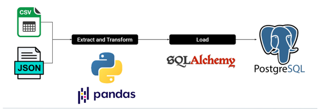

# Project_2

For this project, we decided to use Covid-19 vaccine data (https://www.kaggle.com/datasets/paultimothymooney/usa-covid19-vaccinations) and Covid-19 case data (https://data.cdc.gov/Case-Surveillance/COVID-19-Case-Surveillance-Public-Use-Data-with-Ge/n8mc-b4w4).

Below are the steps we followed :

* We extracted data from Kaggle's database of Covid-19 vaccination data doing an API pull request and a read function in python. The data was cleaned and extracted into  two dataframes. 

* Next we loaded those dataframe into postgresql using SQLAlchemy.

* Finally, we created tables and schema to write queries against thes tables.

